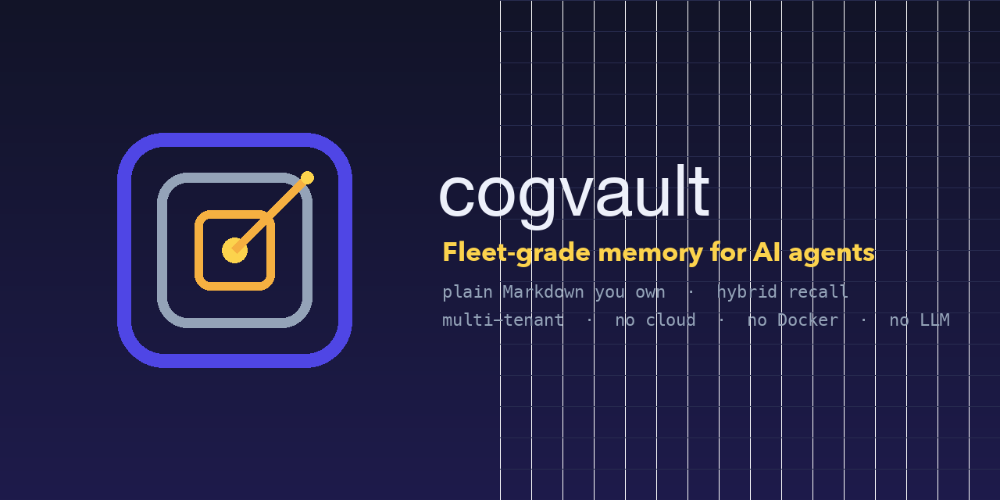
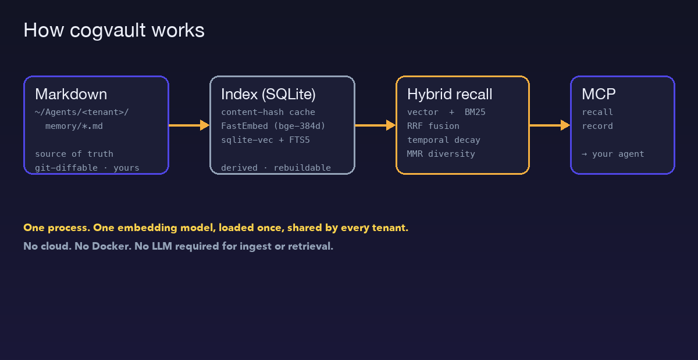

<div align="center">



# cogvault

**Fleet-grade local memory for AI agents — over plain Markdown you own.**

[](LICENSE)
[](https://www.python.org)
[](https://modelcontextprotocol.io)

Hybrid recall · multi-tenant · one process · **no cloud, no Docker, no LLM**

</div>

---

## Why

Most "AI agent memory" tools want to be an autonomous LLM daemon that summarizes your
work into an opaque database or a graph you can't read. For a fleet of coding agents
that just need to *reliably recall a decision, a bug fix, or an infra detail*, that's
the wrong trade.

`cogvault` makes the opposite bet:

- **Your Markdown files are the source of truth.** Open them, edit them, `git diff`
  them. The SQLite index is a derived cache — delete it and it rebuilds from the files.
- **One process serves your whole fleet.** Each agent gets an isolated memory
  namespace via its own directory — not a separate daemon per agent.
- **One embedding model, loaded once.** Shared across every tenant. ~130 MB resident,
  not multiplied by your agent count.
- **No LLM in the loop.** Ingest and retrieval are deterministic. Your agent *is* the
  LLM — it doesn't need a second one to remember.
- **Local, private, offline.** [FastEmbed](https://github.com/qdrant/fastembed) runs
  on-device. Nothing leaves your machine.

## How it works



Hybrid retrieval fuses semantic (vector) and keyword (BM25/FTS5) ranking with
[Reciprocal Rank Fusion](https://plg.uwaterloo.ca/~gvcormac/cormacksigir09-rrf.pdf),
then applies optional **temporal decay** (recent memory outranks stale) and **MMR**
(diverse top results, not five near-duplicates).

## Benchmark

On 15 paraphrased English queries (zero keyword overlap with target files) over a real
18-file agent memory directory, against a closed-source incumbent (an FSRS Rust binary):

| System                              | hit@1   | hit@3   | MRR       | scoring             |
|-------------------------------------|---------|---------|-----------|---------------------|
| cogvault · `bge-small-en` (EN-tuned)| **87%** | **93%** | **0.900** | strict (exact file) |
| cogvault · multilingual (default)   | 60%     | 87%     | 0.728     | strict (exact file) |
| incumbent                           | 53%     | 80%     | 0.683     | lenient (substring) |

Both cogvault configs beat the incumbent *despite being graded more strictly* (exact
filename vs. lenient substring). The English-tuned model is sharper on English; the
multilingual default trades some of that for **working Cyrillic recall** (see the model
table above). 15 queries is a smoke test, not a leaderboard — run it on your own vault.

## Choosing an embedding model

Agent memory is often **not** English-only. The default is multilingual so nothing
is *broken* out of the box — but pick the model that matches your fleet's language mix
(set `COGVAULT_MODEL`, or `Config(model=...)`). Switching models auto-rebuilds the index.

| Model (`COGVAULT_MODEL`) | Dim | Size | EN recall* | Cyrillic / multilingual | When |
|--------------------------|-----|------|-----------|--------------------------|------|
| `paraphrase-multilingual-MiniLM-L12-v2` **(default)** | 384 | 0.22 GB | hit@1 60% | ✅ works | Mixed-language fleets; safe default |
| `BAAI/bge-small-en-v1.5` | 384 | 0.13 GB | **hit@1 87%** | ❌ Cyrillic vectors break | English-only memory |
| `intfloat/multilingual-e5-large` | 1024 | 2.24 GB | high | ✅ best | Max quality, RAM to spare |

<sub>*15-query ground-truth smoke test over a real mixed EN/UK memory dir. The default
trades some English sharpness for working Cyrillic recall — `bge-small-en` returns a
**negative** relevance margin on Ukrainian queries (a distractor outranks the answer),
so it is unsafe for non-English content. Run `cogvault` on your own vault to decide.</sub>

```bash
COGVAULT_MODEL=BAAI/bge-small-en-v1.5 cogvault index --tenant ~/agent/memory
```

## Install

```bash
pip install cogvault
```

## Quickstart

```bash
# index a tenant's markdown memory
cogvault index --tenant ~/agent/memory

# search (hybrid semantic + keyword)
cogvault search --tenant ~/agent/memory "how do I restart the worker service"

# enable temporal decay (recent wins) and tune diversity
cogvault search --tenant ~/agent/memory "deployment steps" --half-life 30 --mmr 0.5
```

### As an MCP server (Claude Code, Cursor, any MCP client)

```bash
claude mcp add cogvault -- cogvault mcp --tenant ~/agent/memory
```

Exposes two tools:

- `cogvault_recall` — natural-language hybrid search over this agent's memory
- `cogvault_record` — save a fact; it's written as a Markdown card and indexed

### As a library

```python
from cogvault import Vault, Config

vault = Vault("~/agent/memory", Config(half_life_days=30))
vault.reindex()
for hit in vault.search("where are credentials stored"):
    print(hit["score"], hit["file"], hit["snippet"])
```

## Effectiveness logging

Every recall is logged (one JSONL line) so you can measure whether the memory is
actually helping. `cogvault analyze` turns the log into a report:

```bash
cogvault analyze            # recalls, no-hit rate, latency p50/p95, avg top score
cogvault analyze --json     # machine-readable
```

The **no-hit rate** and **recent no-hit queries** are the signal that matters: they
tell you what your agents tried to recall and *couldn't* — i.e. the memory gaps to
fill. Set `COGVAULT_LOG=off` to disable, or `COGVAULT_LOG=/path.jsonl` to relocate.

## Multi-tenant fleets

Point one process at many tenants — each directory is an isolated namespace, proven by
the test suite (`test_multi_tenant_isolation`). Agent B can never recall Agent A's
memory unless you point B at A's directory.

```
~/agents/
├── agent-a/memory/     ← cogvault tenant
├── agent-b/memory/     ← cogvault tenant
└── agent-c/memory/     ← cogvault tenant
```

## Design notes

| Decision | Why |
|----------|-----|
| Markdown = source of truth | Human-readable, `git`-versionable, editable, never locked in a DB |
| SQLite + `sqlite-vec` + FTS5 | Zero-infra hybrid search; one portable `.db` file; rebuildable |
| FastEmbed (`bge-small-en-v1.5`, 384-d) | In-process, no server, no API key, ~130 MB |
| Content-hash cache | Re-indexing only embeds *changed* chunks |
| RRF + decay + MMR | Precision, recency, and diversity without a graph DB |
| One process, many tenants | Fleet infra, not a single-user desktop sidecar |
| WAL + incremental reindex | Concurrent agents read while one writes; only changed files re-embed |

## Roadmap

- [ ] Importers (migrate existing memory from other stores)
- [ ] Pluggable embedders (Ollama, OpenAI-compatible endpoint)
- [ ] `valid_until` per-card temporal validity
- [ ] Optional FastMCP transport

## License

[MIT](LICENSE) — your memory, your files, your infrastructure. Forever.
