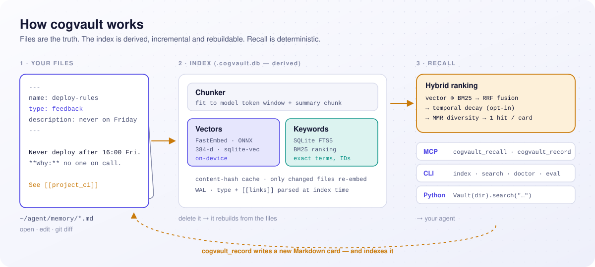
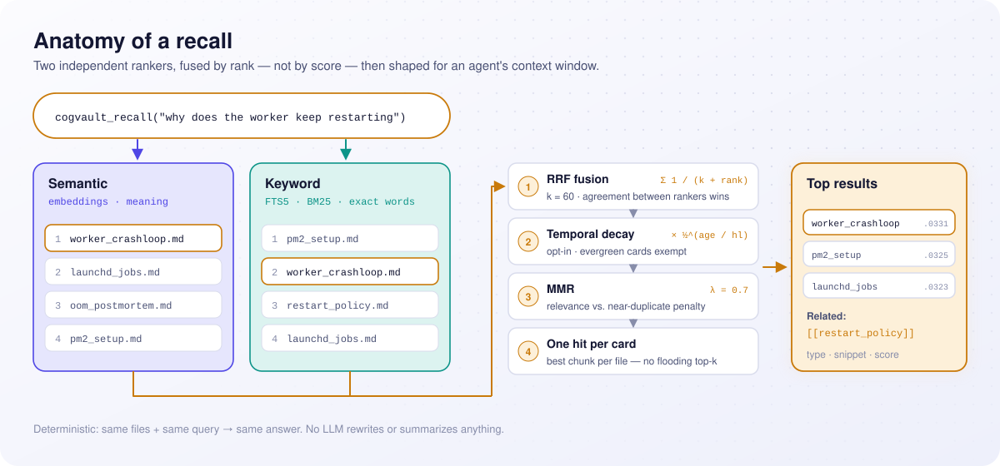
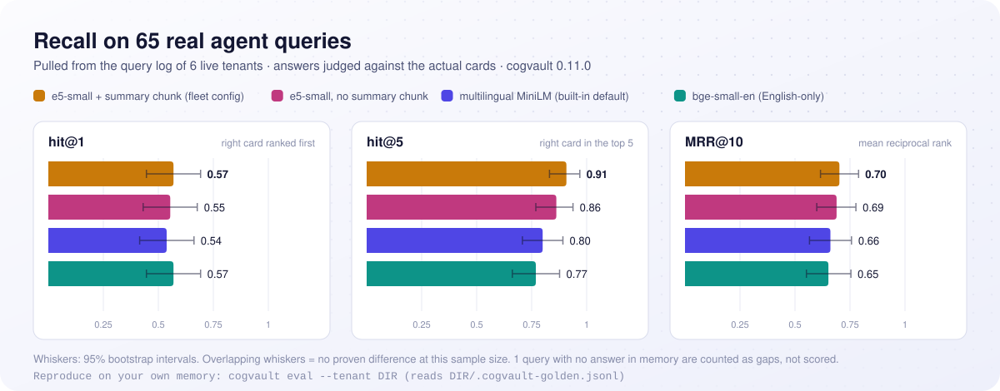
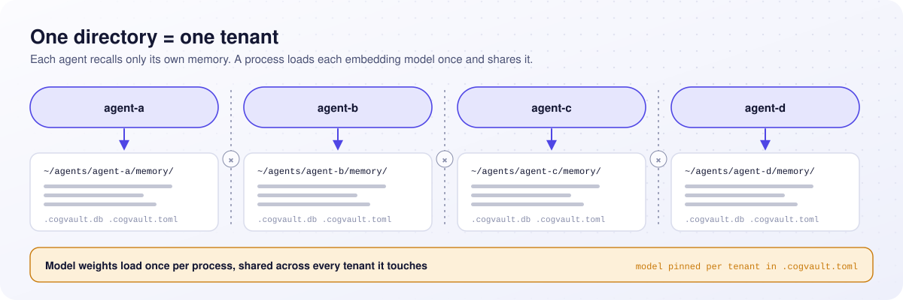

<div align="center">

<picture>
  <source media="(prefers-color-scheme: dark)" srcset="assets/hero-dark.svg">
  
</picture>

<br>

[](LICENSE)
[](https://www.python.org)
[](https://modelcontextprotocol.io)
[](https://github.com/NBibikov/cogvault/releases)

**[Why](#why)** · **[How it works](#how-it-works)** · **[Benchmark](#benchmark)** · **[Install](#install)** · **[Quickstart](#quickstart)** · **[MCP](#as-an-mcp-server-claude-code-cursor-any-mcp-client)** · **[Fleets](#multi-tenant-fleets)**

</div>

---

## Why

Most "AI agent memory" tools want to be an autonomous LLM daemon that summarizes your
work into an opaque database or a graph you can't read. For a fleet of coding agents
that just need to *reliably recall a decision, a bug fix, or an infra detail*, that's
the wrong trade.

`cogvault` makes the opposite bet:

- **Your Markdown files are the source of truth.** Open them, edit them, `git diff`
  them. The SQLite index is a derived cache — delete it and it rebuilds from the files.
- **One library, many tenants.** Each agent gets an isolated memory namespace via its
  own directory. A process loads each embedding model once and shares it across
  every tenant it touches; with the stdio MCP server that means one small process
  per agent session, not a central daemon.
- **No LLM in the loop.** Ingest and retrieval are deterministic. Your agent *is* the
  LLM — it doesn't need a second one to remember.
- **Local, private, offline.** [FastEmbed](https://github.com/qdrant/fastembed) runs
  on-device. Nothing leaves your machine.

## How it works

<picture>
  <source media="(prefers-color-scheme: dark)" srcset="assets/architecture-dark.svg">
  
</picture>

### Anatomy of a recall

<picture>
  <source media="(prefers-color-scheme: dark)" srcset="assets/recall-dark.svg">
  
</picture>

Hybrid retrieval fuses semantic (vector) and keyword (BM25/FTS5) ranking with
[Reciprocal Rank Fusion](https://plg.uwaterloo.ca/~gvcormac/cormacksigir09-rrf.pdf),
then applies optional **temporal decay** (recent memory outranks stale) and **MMR**
(diverse top results, not five near-duplicates). Each card contributes only its
best chunk, so one long file can't fill the whole result list.

## Benchmark

<picture>
  <source media="(prefers-color-scheme: dark)" srcset="assets/benchmark-dark.svg">
  
</picture>

<details>
<summary>Table and method</summary>

On 15 paraphrased English queries (zero keyword overlap with target files) over a real
18-file agent memory directory, against a closed-source incumbent (an FSRS Rust binary):

| System                              | hit@1   | hit@3   | MRR       | scoring             |
|-------------------------------------|---------|---------|-----------|---------------------|
| cogvault · `bge-small-en` (EN-tuned)| **87%** | **93%** | **0.900** | strict (exact file) |
| cogvault · multilingual (default)   | 60%     | 87%     | 0.728     | strict (exact file) |
| incumbent                           | 53%     | 80%     | 0.683     | lenient (substring) |

</details>

Both cogvault configs beat the incumbent *despite being graded more strictly* (exact
filename vs. lenient substring). The English-tuned model is sharper on English; the
multilingual default trades some of that for **working Cyrillic recall** (see the model
table below). 15 queries is a smoke test, not a leaderboard — run it on your own vault.

## Choosing an embedding model

Agent memory is often **not** English-only. The default is multilingual so nothing
is *broken* out of the box — but pick the model that matches your fleet's language mix
(set `COGVAULT_MODEL`, or `Config(model=...)`). Switching models auto-rebuilds the index.

| Model (`COGVAULT_MODEL`) | Dim | Size | EN recall* | Cyrillic / multilingual | When |
|--------------------------|-----|------|-----------|--------------------------|------|
| `paraphrase-multilingual-MiniLM-L12-v2` **(default)** | 384 | 0.22 GB | hit@1 60% | ✅ works | Mixed-language fleets; safe default |
| `BAAI/bge-small-en-v1.5` | 384 | 0.13 GB | **hit@1 87%** | ❌ Cyrillic vectors break | English-only memory |
| `intfloat/multilingual-e5-small` | 384 | 0.47 GB | — | ✅ best per GB (512-token window) | Mixed-language fleets; use `chunk_chars = 700` |
| `intfloat/multilingual-e5-large` | 1024 | 2.24 GB | high | ✅ best | Max quality, RAM to spare |

<sub>*15-query ground-truth smoke test over a real mixed EN/UK memory dir. The default
trades some English sharpness for working Cyrillic recall — `bge-small-en` returns a
**negative** relevance margin on Ukrainian queries (a distractor outranks the answer),
so it is unsafe for non-English content. Run `cogvault` on your own vault to decide.</sub>

```bash
COGVAULT_MODEL=BAAI/bge-small-en-v1.5 cogvault index --tenant ~/agent/memory
```

**Pin the model per tenant** so it travels with the data instead of relying on every
command exporting `COGVAULT_MODEL` (forget it once and a model mismatch silently
re-embeds the whole index). Drop a `.cogvault.toml` at the tenant root:

```toml
# ~/agent/memory/.cogvault.toml
model = "BAAI/bge-small-en-v1.5"
# optional: recursive = true, strip_frontmatter = true, ignore_globs = ["Templates/*"]
```

Now `cogvault search --tenant ~/agent/memory "…"` uses the right model with no env var.
Precedence: explicit `--model` / `$COGVAULT_MODEL` > `.cogvault.toml` > built-in default.

## Install

Not on PyPI yet — install from GitHub (a tagged release, or `main`):

```bash
uv tool install git+https://github.com/NBibikov/cogvault@v0.11.0   # CLI on PATH
# or
pip install git+https://github.com/NBibikov/cogvault@v0.11.0
```

Release wheels are also attached to each [GitHub release](https://github.com/NBibikov/cogvault/releases).

## Quickstart

```bash
# index a tenant's markdown memory
cogvault index --tenant ~/agent/memory

# search (hybrid semantic + keyword)
cogvault search --tenant ~/agent/memory "how do I restart the worker service"

# enable temporal decay (recent wins) and tune diversity
cogvault search --tenant ~/agent/memory "deployment steps" --half-life 30 --mmr 0.5

# only cards of one frontmatter type (user / feedback / project / reference / …)
cogvault search --tenant ~/agent/memory "hard rules for deploys" --type feedback
```

### Memory cards

cogvault understands two lightweight Markdown conventions (both optional —
plain files index fine):

- **Frontmatter `type`** — either flat (`type: reference`) or nested
  (`metadata:` → `type: reference`). Parsed at index time and filterable at
  search time (`--type`, MCP `type` param, `search(card_type=...)`). Every hit
  carries a `type` field; cards without frontmatter get `null`.
- **`[[wiki-links]]`** — link targets are indexed, and the top search result
  includes a `related` list of linked cards that exist in the index (ghost
  links are dropped; matching is by exact filename stem).

### As an MCP server (Claude Code, Cursor, any MCP client)

```bash
claude mcp add cogvault -- cogvault mcp --tenant ~/agent/memory
```

Exposes two tools:

- `cogvault_recall` — natural-language hybrid search over this agent's memory.
  Optional `type` param filters to one frontmatter card type; the top result
  includes a `Related:` line built from its `[[wiki-links]]`.
- `cogvault_record` — save a fact; it's written as a Markdown card and indexed

### Indexing a folder tree (Obsidian vaults, knowledge bases)

By default a tenant is one flat directory of `.md` files. For a nested vault
(e.g. Obsidian, with `01-Projects/…`, frontmatter, and folders to skip), opt in:

```bash
cogvault index --tenant ~/vault \
  --recursive \
  --strip-frontmatter \
  --ignore ".obsidian/*" --ignore ".trash/*" --ignore "Templates/*"
```

- `--recursive` walks subdirectories; files keep their path relative to the tenant,
  so two notes named `Tasks.md` in different folders never collide.
- `--strip-frontmatter` drops a leading YAML `--- … ---` block so its keys don't
  pollute the embedding.
- `--ignore GLOB` (repeatable) skips paths relative to the tenant root.

Same flags exist on `search` and `mcp`, and as `Config(recursive=True,
strip_frontmatter=True, ignore_globs=(...))` for the library. Indexing is
incremental: the first pass embeds everything, later passes only re-embed changed
files. (Reference: a ~3,500-note vault → ~9,500 chunks, first index ≈ 3–4 min,
then warm recall in single-digit milliseconds.)

### As a library

```python
from cogvault import Vault, Config

vault = Vault("~/agent/memory", Config(half_life_days=30))
vault.reindex()
for hit in vault.search("where are credentials stored"):
    print(hit["score"], hit["file"], hit["snippet"])
```

## Keeping a tenant healthy

`cogvault doctor --tenant DIR` reports what silently degrades recall: cards with
no frontmatter or type, legacy timestamp filenames, frontmatter wrapped inside
frontmatter, duplicate `name:` slugs, and `[[links]]` that resolve to nothing.
Links resolve by frontmatter `name:`, filename stem, either separator style, and
with or without the card-type prefix; links inside code and paths to files outside
the tenant are not counted.

`cogvault repair --tenant DIR` fixes the mechanical half (dry run by default,
`--apply` to write): unwraps nested frontmatter, infers a missing type, renames
`card-<timestamp>-….md` to `<type>_<slug>.md` and rewrites every reference to it
(MEMORY.md included), and adds minimal frontmatter to `<type>_*.md` cards that
lack it. Healthy cards are left alone, and repaired cards keep their mtime so
temporal decay is not reset.

## Effectiveness logging

Every recall is logged (one JSONL line) so you can measure whether the memory is
actually helping. `cogvault analyze` turns the log into a report:

```bash
cogvault analyze            # recalls, no-hit rate, latency p50/p95, avg top score
cogvault analyze --json     # machine-readable
```

The **no-hit rate** and **recent no-hit queries** are the signal that matters: they
tell you what your agents tried to recall and *couldn't* — i.e. the memory gaps to
fill. Set `COGVAULT_LOG=off` to disable, or `COGVAULT_LOG=/path.jsonl` to relocate.

## Multi-tenant fleets

Point one process at many tenants — each directory is an isolated namespace, proven by
the test suite (`test_multi_tenant_isolation`). Agent B can never recall Agent A's
memory unless you point B at A's directory.

<picture>
  <source media="(prefers-color-scheme: dark)" srcset="assets/fleet-dark.svg">
  
</picture>

## Design notes

| Decision | Why |
|----------|-----|
| Markdown = source of truth | Human-readable, `git`-versionable, editable, never locked in a DB |
| SQLite + `sqlite-vec` + FTS5 | Zero-infra hybrid search; one portable `.db` file; rebuildable |
| FastEmbed (multilingual MiniLM default, 384-d) | In-process ONNX, no server, no API key, ~220 MB |
| Content-hash cache | Re-indexing only embeds *changed* chunks |
| RRF + decay + MMR | Precision, recency, and diversity without a graph DB |
| One process, many tenants | Fleet infra, not a single-user desktop sidecar |
| WAL + incremental reindex | Concurrent agents read while one writes; only changed files re-embed |

## Roadmap

- [ ] Importers (migrate existing memory from other stores)
- [ ] Pluggable embedders (Ollama, OpenAI-compatible endpoint)
- [ ] `valid_until` per-card temporal validity
- [ ] Optional FastMCP transport

## License

[MIT](LICENSE) — your memory, your files, your infrastructure. Forever.

<sub>Figures are hand-built SVG from [`assets/make_graphics.py`](assets/make_graphics.py) — `python assets/make_graphics.py --png` regenerates them.</sub>
